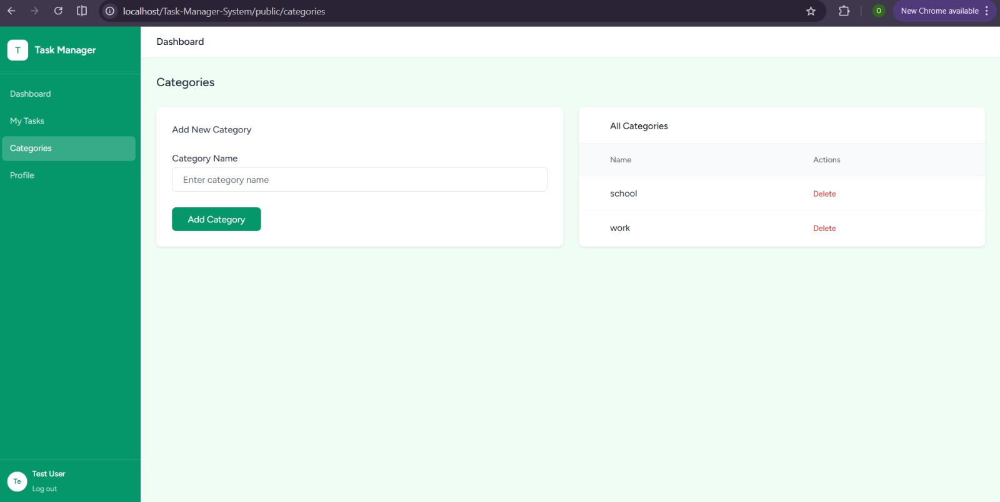

# Task Management System

A full-featured web application built with **Laravel 12** for the **ICE360 Web Frameworks Module**. The system enables users to create, manage, assign, update, and track tasks efficiently within an organization or team environment.

---

## Description

The Task Management System includes user authentication, role-based access control, task assignment, task categorization, priority management, and task status tracking.

The application was developed using Laravel's MVC architecture and modern web development practices to provide a secure and user-friendly task management solution.

---

## Features

### User Authentication

* User Registration
* User Login and Logout
* Authentication using Laravel Breeze
* Protected Routes using Middleware

### Task Management

* Create Tasks
* Edit Tasks
* Delete Tasks
* Assign Tasks to Users
* Task Status Tracking (Pending, In Progress, Completed)
* Task Priority Management (Low, Medium, High)
* Task Category Management

### Dashboard

* Dashboard Statistics
* Recent Tasks Overview
* Task Monitoring

### Security Features

* CSRF Protection
* XSS Prevention using Blade Escaping
* Form Validation
* Password Hashing
* Secure Route Protection
* SQL Injection Prevention using Eloquent ORM

### User Interface

* Responsive Design
* Modern Dashboard Layout
* Tailwind CSS Styling
* Interactive User Experience

---

## Technologies Used

| Technology            | Purpose                          |
| --------------------- | -------------------------------- |
| Laravel 12            | Backend Framework                |
| PHP 8+                | Server-Side Programming Language |
| SQLite                | Database Management System       |
| Blade Template Engine | Frontend Templating              |
| Tailwind CSS          | Styling Framework                |
| Laravel Breeze        | Authentication                   |
| Vite                  | Frontend Asset Bundler           |
| Node.js & npm         | Frontend Tooling                 |
| Git & GitHub          | Version Control                  |

---

## UI Template Source

The user interface was built using:

* Tailwind CSS
* Laravel Breeze Starter Kit
* Customized Admin Dashboard Design

All components were modified and integrated into Laravel Blade templates.

---

## Requirements

Before running the project, ensure the following software is installed:

* PHP 8+
* Composer
* Node.js
* npm
* Laravel 12
* SQLite

---

## Installation Guide

### 1. Clone the Repository

```bash
git clone https://github.com/tebogomakgato26/Task-Manager-System.git
```

### 2. Navigate to the Project Directory

```bash
cd Task-Manager-System
```

### 3. Install PHP Dependencies

```bash
composer install
```

### 4. Install Frontend Dependencies

```bash
npm install
```

### 5. Create the Environment File

```bash
cp .env.example .env
```

### 6. Generate the Application Key

```bash
php artisan key:generate
```

---

## Database Configuration

This project uses **SQLite** as its database.

Update the `.env` file:

```env
DB_CONNECTION=sqlite
```

Create the SQLite database file:

```bash
touch database/database.sqlite
```

> No username, password, host, or port configuration is required when using SQLite.

---

## Environment Setup

```env
APP_NAME=TaskManager
APP_ENV=local
APP_KEY=
APP_DEBUG=true
APP_URL=http://127.0.0.1:8000

DB_CONNECTION=sqlite
```

---

## Database Migration

Run the database migrations:

```bash
php artisan migrate
```

---

## Database Seeding (Optional)

Populate the database with sample data:

```bash
php artisan db:seed
```

---

## Running the Application

### Option 1: Run Everything with One Command

```bash
npm run dev-all
```

This command starts:

* Laravel Development Server
* Vite Development Server
* Tailwind CSS Compilation

### Option 2: Run Servers Separately

#### Start Laravel

```bash
php artisan serve
```

#### Start Vite

```bash
npm run dev
```

---

## Access the Application

Open the application in your browser:

```text
http://127.0.0.1:8000
```

---

## How to Use the System

1. Register a new account.
2. Log in using your credentials.
3. Create tasks.
4. Assign tasks to users.
5. Update task statuses.
6. Manage categories and priorities.
7. Monitor tasks using the dashboard.

---

## Authentication and Authorization

The application uses **Laravel Breeze** for authentication and session management.

Features include:

* User Registration
* Login and Logout
* Protected Routes
* Middleware Authentication
* Role-Based Access Control
* Policies and Gates

---

## Database

The system uses **SQLite** as its database management system.

### Database Features

* Laravel Migrations
* Eloquent ORM Relationships
* Foreign Key Constraints
* Database Seeders
* Factories for Test Data

---

## Database Schema

### Users Table

| Column     | Type      | Description             |
| ---------- | --------- | ----------------------- |
| id         | Integer   | Primary Key             |
| name       | String    | User's Full Name        |
| email      | String    | Unique Email Address    |
| password   | String    | Hashed Password         |
| role       | String    | Admin, Member, or Guest |
| created_at | Timestamp | Creation Timestamp      |
| updated_at | Timestamp | Update Timestamp        |

### Tasks Table

| Column      | Type        | Description                     |
| ----------- | ----------- | ------------------------------- |
| id          | Integer     | Primary Key                     |
| title       | String      | Task Title                      |
| description | Text        | Task Description                |
| status      | Enum        | Pending, In Progress, Completed |
| priority    | Enum        | Low, Medium, High               |
| due_date    | Date        | Task Due Date                   |
| user_id     | Foreign Key | Assigned User                   |
| category_id | Foreign Key | Task Category                   |
| created_at  | Timestamp   | Creation Timestamp              |
| updated_at  | Timestamp   | Update Timestamp                |

### Categories Table

| Column     | Type      | Description        |
| ---------- | --------- | ------------------ |
| id         | Integer   | Primary Key        |
| name       | String    | Category Name      |
| created_at | Timestamp | Creation Timestamp |
| updated_at | Timestamp | Update Timestamp   |

---

## Security Features

* CSRF Protection
* XSS Prevention
* SQL Injection Prevention
* Password Hashing
* Middleware Authentication
* Input Validation
* Role-Based Access Control

---

## System Architecture

The application follows Laravel's **Model-View-Controller (MVC)** architecture.

### Models

Handle database interactions and Eloquent relationships.

### Views

Built using Blade Templates and Tailwind CSS.

### Controllers

Handle business logic, validation, and application requests.

---
## Project Structure

The project follows Laravel's standard folder structure:


- `app/` → Application logic

- `routes/` → Application routes

- `resources/views/` → Blade templates

- `database/` → Migrations and seeders

- `public/` → Public assets

- `config/` → Configuration files

```

---

## Screenshots

### Login Page


---

### Dashboard


---

### Create Task Page


---

### Categories Page



---

## Test Login Details

### Administrator Account

```text
Email: test@test.com
Password: password123
```

### Standard User Account

```text
Email: admin@gmail.com
Password: admin123
```

---

## Authors

* Tebogo Makgato
* Oratilwe Komane

---

## GitHub Repository

Repository Link:

```text
https://github.com/tebogomakgato26/Task-Manager-System
```

---


## Project Highlights

This project demonstrates:

* Laravel Routing
* Middleware Implementation
* Authentication and Authorization
* Blade Templating
* Eloquent ORM
* Database Migrations and Seeders
* Form Validation
* Tailwind CSS Integration
* Responsive Web Design
* Git Version Control

---


