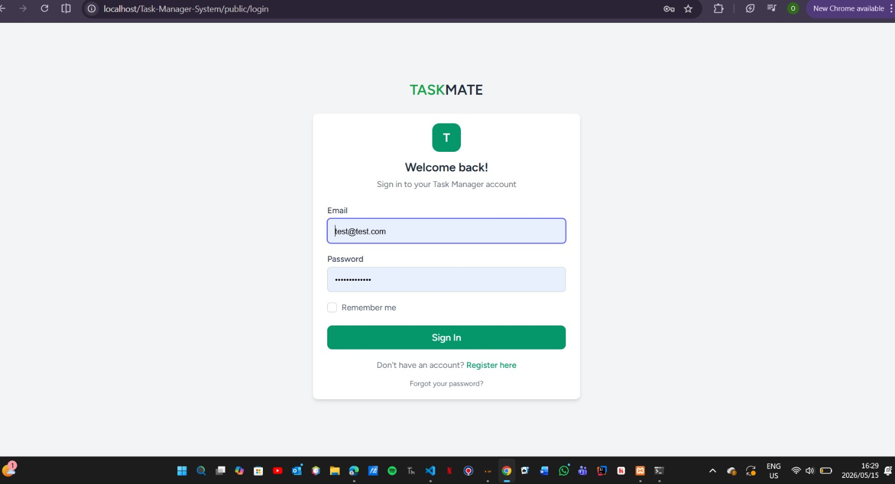
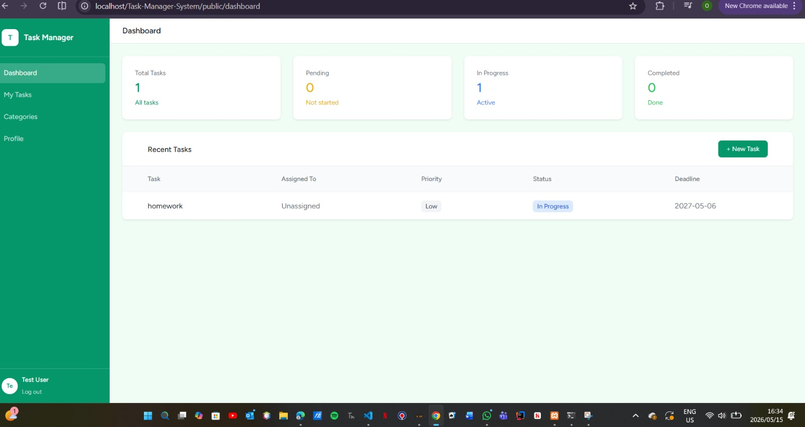
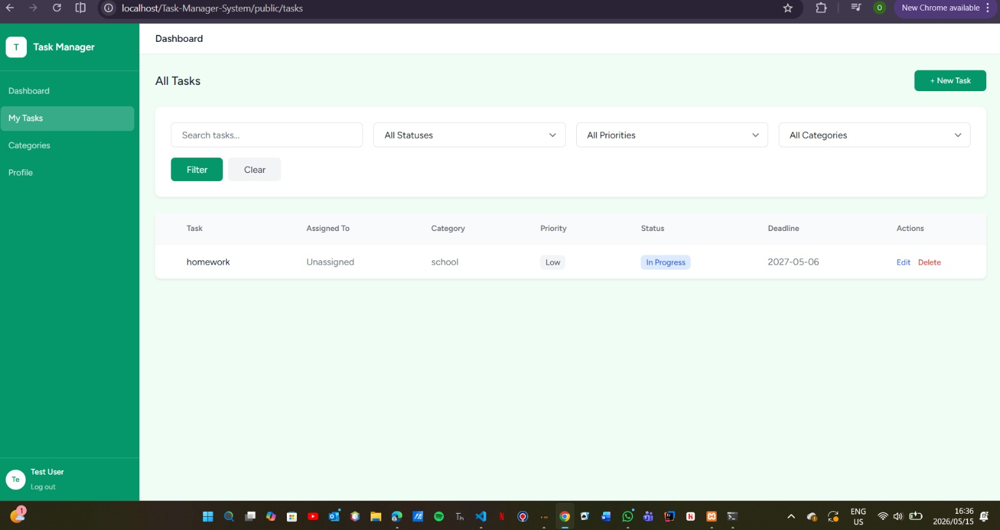

## Description

The Task Management System is a web-based application developed using Laravel 12.  
The system allows users to create, manage, assign, update, and track tasks efficiently within an organization or team environment.

The application includes authentication, role-based access control, task assignment, task categorization, and task status tracking functionalities. The project was developed for the ICE360 Web Frameworks module.

---

## Features

### User Authentication
- User Registration
- User Login and Logout
- Authentication using Laravel Breeze
- Protected Routes using Middleware

### Task Management
- Create Tasks
- Edit Tasks
- Delete Tasks
- Assign Tasks to Users
- Task Status Tracking
- Task Priority Management
- Task Category Management

### Dashboard
- Dashboard Statistics
- Recent Tasks Overview
- Task Monitoring

### Security Features
- CSRF Protection
- Form Validation
- Password Hashing
- Secure Route Protection
- Eloquent ORM Protection against SQL Injection

### User Interface
- Responsive Design
- Modern Dashboard Layout
- Tailwind CSS Styling
- Interactive User Experience

---

## Technologies Used

- Laravel 12
- PHP 8
- MySQL
- XAMPP
- Blade Template Engine
- Tailwind CSS
- Laravel Breeze
- Vite
- Node.js
- npm
- Git & GitHub

---

## Installation Guide

### 1. Clone the Repository

```bash
git clone https://github.com/tebogomakgato26/Task-Manager-System.git
```

### 2. Navigate into the Project Folder

```bash
cd Task-Manager-System
```

### 3. Install PHP Dependencies

```bash
composer install
```

### 4. Install Frontend Dependencies

```bash
npm install
```

### 5. Create the Environment File

```bash
cp .env.example .env
```

### 6. Generate Application Key

```bash
php artisan key:generate
```

---

## Database Configuration

Update the following database details inside the `.env` file:

```env
DB_CONNECTION=mysql
DB_HOST=127.0.0.1
DB_PORT=3306
DB_DATABASE=task_manager
DB_USERNAME=root
DB_PASSWORD=
```

---

## Run Database Migrations

```bash
php artisan migrate
```

---

## Run Database Seeders (Optional)

```bash
php artisan db:seed
```

---

# Running the Application

## Option 1: Run Everything with One Command

```bash
npm run dev-all
```

This command starts:
- Laravel development server
- Vite frontend server
- Tailwind CSS compilation

---

## Option 2: Run Servers Separately

### Start Laravel Server

```bash
php artisan serve
```

### Start Frontend Development Server

```bash
npm run dev
```

---

## Access the Application

Open the application in your browser:

```text
http://127.0.0.1:8000
```

---

## How to Use the System

1. Register a new account
2. Login using your credentials
3. Create and manage tasks
4. Assign tasks to users
5. Update task statuses
6. Manage task categories and priorities
7. Monitor tasks from the dashboard

---

## Authentication & Authorization

The application uses Laravel Breeze for authentication and session management.

Features include:
- User Registration
- Login and Logout
- Protected Routes
- Middleware Authentication
- Role-Based Access Control

---

## Database

The system uses MySQL as the database management system.

Database features include:
- Laravel Migrations
- Eloquent ORM Relationships
- Foreign Key Constraints
- Database Seeders
- Factories for Test Data

---

## Security Features

- CSRF Protection
- Form Validation
- Password Hashing
- Secure Middleware Authentication
- Eloquent ORM Query Protection
- Input Validation

---

## System Architecture

The application follows the MVC (Model-View-Controller) architecture provided by Laravel.

### Models
Handle database interactions and relationships.

### Views
Built using Blade Templates and Tailwind CSS.

### Controllers
Manage business logic and application requests.

---

## Screenshots

### Login Page


---

### Dashboard


---


### Create Task Page


---

### Categories Page


---

## Test Login Details

### Admin Account

Email:
```text
test@test.com
```

Password:
```text
password123
```

---

### User Account

Email:
```text
dineomas773@gmail.com
```

Password:
```text
987654321
```

---

## Project Structure

The project follows Laravel's standard folder structure:

- `app/` → Application logic
- `routes/` → Application routes
- `resources/views/` → Blade templates
- `database/` → Migrations and seeders
- `public/` → Public assets
- `config/` → Configuration files

---

## Authors

- Tebogo Makgato
- Oratilwe Komane

---

## GitHub Repository

Repository Link:

```text
https://github.com/tebogomakgato26/Task-Manager-System
```

---

## Notes

This project was developed for the ICE360 Web Frameworks module.

The application demonstrates the implementation of:
- Laravel Routing
- Middleware
- Authentication and Authorization
- Blade Templating
- Eloquent ORM
- Database Migrations and Seeders
- Tailwind CSS Integration
- Responsive Web Design
- Git Version Control

---


